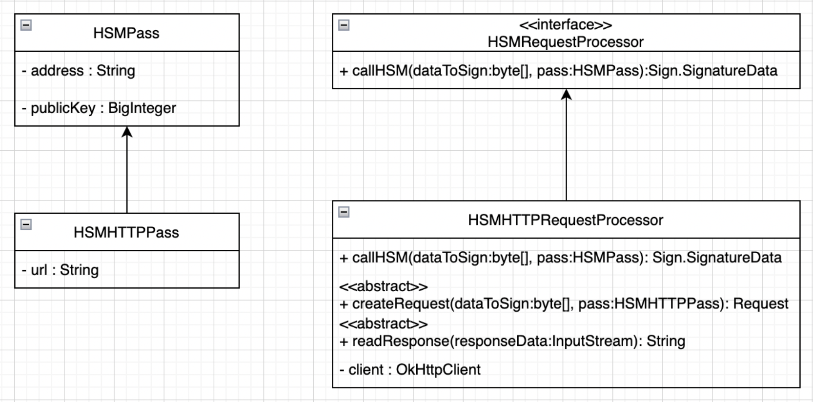

HSM Transaction Signing
==================

Hardware Security Modules, HSMs, are cryptographic hardware devices that protects and manages data or assets and facilitates signing, verification, encryption and decryption. In the blockchain space they are typically used for protecting the cryptographic keys that are used for signing transactions. As these types of keys are heavily used in signing and validating transactions, they can be directly used from HSM in order to avoid any security leaks that might be met by in an online environment.
Starting with web3j-4.9.0 HSM modules are supported in signing blockchain transactions.

Web3j implementation
-----------------------------

To make this possible, a new transaction signing class has been created: [TxHSMSignService](https://github.com/web3j/web3j/blob/master/core/src/main/java/org/web3j/service/TxHSMSignService.java). This extends TxSignService so it can be easily added to the transaction manager instantiation in order to sign transactions.


TxHSMSignService is based on other two classes. First is [HSMPass](https://github.com/web3j/web3j/blob/master/crypto/src/main/java/org/web3j/crypto/HSMPass.java) that holds the address and the public key in order to can perform a request to a HSM. Second one is [HSMRequestProcessor](https://github.com/web3j/web3j/blob/master/core/src/main/java/org/web3j/service/HSMRequestProcessor.java) which process the request to HSM.


Usage in web3j
-----------------------------

To implement and sign transactions with HSM using Web3j do the following:

- Implement HSMRequestProcessor in order to handle requests submitted to the HSM. Currently Web3J handles HTTP request to HSM which is implemented in the classes HSMHTTPRequestProcessor and HSMHTTPPass, see class diagram below:


NOTE! HSMHTTPRequestProcessor is an abstract class so you need to extend it and to implement proper handling for createRequest and readRespons methods. Check [this](https://github.com/web3j/web3j/blob/master/core/src/test/java/org/web3j/tx/HSMHTTPRequestProcessorTestImpl.java) unit test to inspire.

- Instantiate new HSMPass object:
```java
HSMHTTPPass hsmhttpPass = new HSMHTTPPass(
        <account_address>, 
        <account_public_key>, 
        <hms_url>);
```
- Instantiate the new implementation of HSMHTTPRequestProcessor:
```java
HSMHTTPRequestProcessor hsmRequestProcessor = 
        new HSMHTTPRequestProcessorTestImpl<>(<http_client>);
```
- Create new HSM sing service:
```java
TxSignService txHSMSignService = 
        new TxHSMSignService<>(hsmRequestProcessor, hsmhttpPass);
```
- Submit the transaction service to a transaction manager and sign the transaction:
```java
RawTransactionManager transactionManager = new RawTransactionManager(
        web3j, 
        txHSMSignService, 
        <chain_id>); 
String sign = transactionManager.sign();
```

After executing all the steps should have been signed with the private key stored on the HSM.