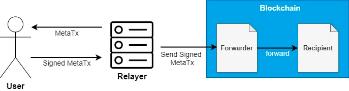

Meta Transactions
==================

Meta transactions are a popular way to enable users to transact on a blockchain without directly paying the gas fees. Instead, they sign a message off-chain, which is then relayed by a relayer who pays the gas fees.



The actors of this scheme are:

- <b>User</b>: signs a meta transaction (that is a message containing information about the transaction he would like to execute).
- <b>Relayer</b>: a web server with a wallet that signs a valid Ethereum transaction (that has the meta transaction as the payload) and sends it to the blockchain.
- <b>Forwarder</b>: an Ethereum contract in charge of verifying the signature of the meta transaction that, not surprisingly, forwards the request to a recipient contract.
- <b>Recipient</b>: the Ethereum contract that the user intended to call without paying the gas fee, this contract has to be able to preserve the identity of the user that initially requested the transaction.

[source](https://medium.com/coinmonks/gas-free-transactions-meta-transactions-explained-f829509a462d)

The Forwarder contract
-----------------------------

The basic mechanism is given by the OpenZeppelin’s MinimalForwarder implementation, to be used together with an ERC2771 compatible contract as the Recipient contract 

Recipient Contract
-----------------------------

```solidity
// SPDX-License-Identifier: MIT
pragma solidity ^0.8.9;

import "@openzeppelin/contracts/metatx/ERC2771Context.sol";

contract Recipient is ERC2771Context {
    
    event FlagCaptured(address previousHolder, address currentHolder, string color);

    address public currentHolder  = address(0);
    string public color = "white";

    constructor(address trustedForwarder) ERC2771Context(trustedForwarder) {}

    function setFlagOwner(string memory _color) external {
        address previousHolder = currentHolder;
        currentHolder = _msgSender();
        color = _color;
        emit FlagCaptured(previousHolder, currentHolder, color);
    }

    function getFlagOwner() external view returns (address, string memory) {
        return (currentHolder, color);
    }
}
```

EIP-712: Typed structured data JSON
-----------------------------

Before proceeding with the code, let's first look at the JSON structure of the data that will be used to sign the message:

```json
{
  "types": {
    "EIP712Domain": [
      {"name": "name", "type": "string"},
      {"name": "version", "type": "string"},
      {"name": "chainId", "type": "uint256"},
      {"name": "verifyingContract", "type": "address"}
    ],
    "ForwardRequest": [
      {"name": "from", "type": "address"},
      {"name": "to", "type": "address"},
      {"name": "value", "type": "uint256"},
      {"name": "gas", "type": "uint256"},
      {"name": "nonce", "type": "uint256"},
      {"name": "data", "type": "bytes"}
    ]
  },
  "primaryType": "ForwardRequest",
  "domain": {
    "name": "MinimalForwarder",
    "version": "0.0.1",
    "chainId": 1,
    "verifyingContract": "<forwarder_contract_address>"
  },
  "message": {
    "from": "<user_address>",
    "to": "<recipient_contract_address>",
    "value": 0,
    "gas": 210000,
    "nonce": "",
    "data": ""
  }
}

```
The above JSON data specifies the EIP712 domain separator and message types for a Meta transaction using the ForwardRequest struct, which has the following fields:

- from (address): the address of the sender
- to (address): the address of the recipient contract
- value (uint256): the amount of Ether to send (0 in our case)
- gas (uint256): the gas limit for the transaction
- nonce (uint256): the nonce of the sender
- data (bytes): the ABI-encoded function call to the recipient contract


Web3j implementation
-----------------------------

Create a Web3j instance and connect to a node:
```java

Web3j web3j = Web3j.build(new HttpService("https://mainnet.infura.io/v3/your-project-id"));
```
Load the MinimalForwarder and Recipient contract
```java
MinimalForwarder minimalForwarder = MinimalForwarder.load("0x707325cd8bc6789f2cd2d87e53438ade70eada11", web3j, credentials, new StaticGasProvider(BigInteger.valueOf(4_100_000_000L),BigInteger.valueOf(6721975L)));
Recipient recipient = Recipient.load("0x88685d266aa6664444820494a98c16b284cda5e6", web3j, credentials, new StaticGasProvider(BigInteger.valueOf(4_100_000_000L),BigInteger.valueOf(6721975L)));
```
Define the recipient function and encode it:
```java
final Function recipientFunction = new Function(
        "setFlagOwner",
        List.of(new org.web3j.abi.datatypes.Utf8String("blue")),
        Collections.emptyList()) {
    };

String encodedFunction = FunctionEncoder.encode(recipientFunction);
```
Get the current nonce for the MinimalForwarder contract:
```java
BigInteger nonce = minimalForwarder.getNonce(credentials.getAddress()).send();   
```
Create a ForwardRequest object
```java
MinimalForwarder.ForwardRequest forwardRequest = new MinimalForwarder.ForwardRequest(
        credentials.getAddress(),
        recipient.getContractAddress(),
        BigInteger.ZERO,
        BigInteger.valueOf(210000),
        nonce,
        Numeric.hexStringToByteArray(encodedFunction));
```
Now read the EIP712 typed structured data json, add the empty values and sign it using Sign.signTypedData()
```java
String jsonMessageString = Files.readString(Paths.get("src/main/resources/data.json").toAbsolutePath());
JSONObject jsonObject = new JSONObject(jsonMessageString);
jsonObject.getJSONObject("message").put("from", credentials.getAddress());
jsonObject.getJSONObject("message").put("nonce", nonce);
jsonObject.getJSONObject("message").put("data", encodedFunction);

String modifiedJsonString = jsonObject.toString();
Sign.SignatureData signature = Sign.signTypedData(modifiedJsonString, credentials.getEcKeyPair());
```
Get signature in Bytes
```java
byte[] retval = new byte[65];
System.arraycopy(signature.getR(), 0, retval, 0, 32);
System.arraycopy(signature.getS(), 0, retval, 32, 32);
System.arraycopy(signature.getV(), 0, retval, 64, 1);
```
Now execute the meta transaction and check if output is correct
```java
minimalForwarder.execute(forwardRequest, getSignatureBytes(retval, BigInteger.valueOf(210000)).send();
System.out.println(recipient.color().send());  // returns "blue" color
```


