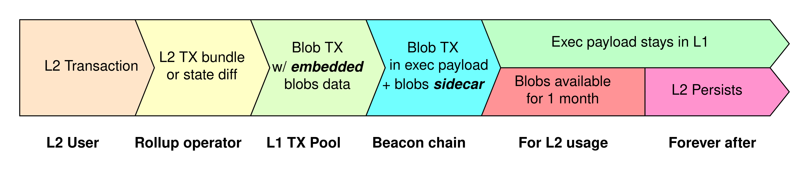
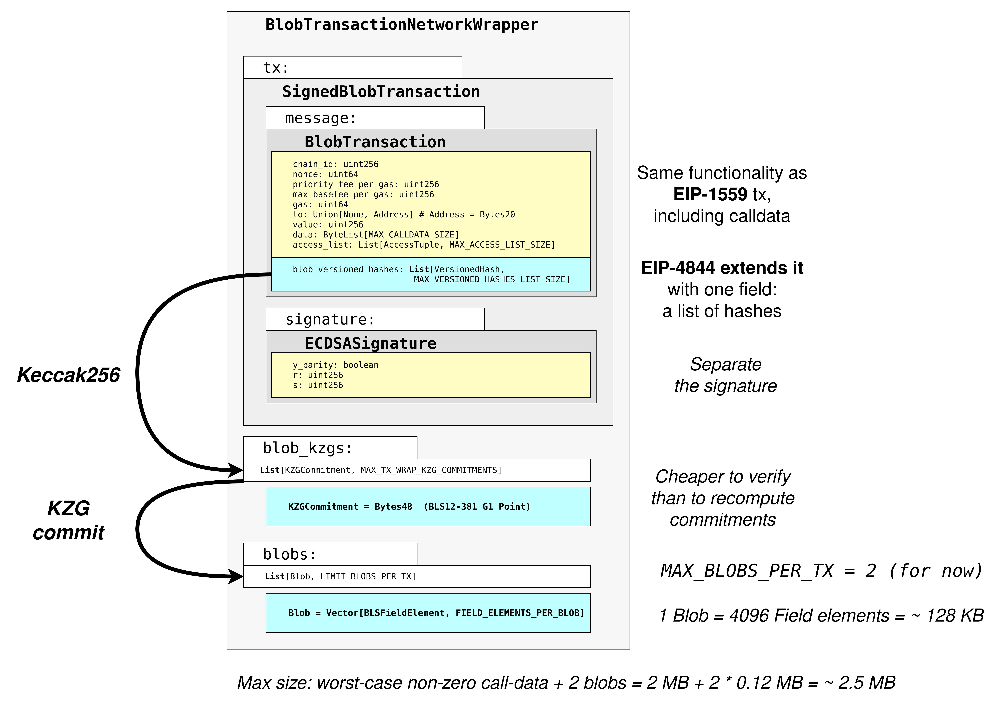

## EIP-4844 Blob Transaction

EIP-4844 introduces a new kind of transaction type to Ethereum “blob-carrying transactions” which contain a large amount of data 
that cannot be accessed by EVM execution, but whose commitment can be accessed. These blobs to be persisted in the beacon
node for a short period of time.

Full data sharding will still take a considerable amount of time to finish implementing and deploying. This EIP provides 
a stop-gap solution until that point by implementing the transaction format that would be used in sharding, 
but not actually sharding those transactions. Instead, the data from this transaction format is simply part of the beacon 
chain and is fully downloaded by all consensus nodes (but can be deleted after only a relatively short delay). Compared 
to full data sharding, this EIP has a reduced cap on the number of these transactions that can be included, corresponding 
to a target of ~0.375 MB per block and a limit of ~0.75 MB.



### Spec

The new type of EIP-2718 transaction, “blob transaction”, where the TransactionType is `BLOB_TX_TYPE` = `Bytes1(0x03)`.
The fields `chain_id`, `nonce`, `max_priority_fee_per_gas`, `max_fee_per_gas`, `gas_limit`, `value`, `data`, and `access_list`
follow the same semantics as EIP-1559.

The field `max_fee_per_blob_gas` is a `uint256` and the field `blob_versioned_hashes` represents a list of hash outputs 
from` kzg_to_versioned_hash`.



### Networking

We can send a signed EIP-4844 transaction to `eth_sendRawTransaction` and the raw form must be the network form. 
This means it includes the tx_payload_body, blobs, KZG commitments, and KZG proofs.

Each of these elements are defined as follows:

- <b>tx_payload_body</b> - is the TransactionPayloadBody of standard EIP-2718 blob transaction
- <b>blobs</b> - list of Blob items
- <b>commitments</b> - list of KZGCommitment of the corresponding blobs
- <b>proofs</b> - list of KZGProof of the corresponding blobs and commitments


### Example

```java
public class Web3App {
    
    public static void main(String[] args) throws Exception {

        Credentials credentials = Credentials.create("<privateKey>");
        Web3j web3j = Web3j.build(new HttpService("<nodeUrl>"));
        
        EthGetTransactionCount ethGetTransactionCount = web3j.ethGetTransactionCount(
                credentials.getAddress(), DefaultBlockParameterName.LATEST).send();
        BigInteger nonce = ethGetTransactionCount.getTransactionCount();
        System.out.println("nonce = " + nonce);

        RawTransaction rawTransaction = createEip4844RawTransaction(nonce);
        // Sign the transaction
        byte[] signedMessage = TransactionEncoder.signMessage(rawTransaction, credentials);
        String hexValue = Numeric.toHexString(signedMessage);
        // Send the transaction
        EthSendTransaction ethSendTransaction = web3j.ethSendRawTransaction(hexValue).send();

        System.out.println("Transaction hash: " + ethSendTransaction.getTransactionHash());
        System.out.println("Tx Receipt = " + web3j.ethGetTransactionReceipt(ethSendTransaction.getTransactionHash()).send().getTransactionReceipt());

        // Tx Receipt = Optional[TransactionReceipt{transactionHash='0x79cfe2c65f1a039b372436cabcd964df1038c45e5d3ebf542af1afca3356a2bc', transactionIndex='0x19',
        // blockHash='0x118be795f782d2d72b38217254efea4817a1a544cd847537049cb5028f87d183', blockNumber='0x4fd448', cumulativeGasUsed='0x142da9', gasUsed='0x5208',
        // contractAddress='null', root='null', status='0x1', from='0x1ba43becc3ea96c37343b7cb18de7386ba29445b', to='0xff00000000000000000000000000000011155421',
        // logs=[], logsBloom='0x00000000000000000000000000000000000000000000000000000000000000000000000000000000000000000000000000000000000000000000000000000000
        // 000000000000000000000000000000000000000000000000000000000000000000000000000000000000000000000000000000000000000000000000000000000000000000000000000000
        // 000000000000000000000000000000000000000000000000000000000000000000000000000000000000000000000000000000000000000000000000000000000000000000000000000000
        // 000000000000000000000000000000000000000000000000000000000000000000000000000000000000', revertReason='null', type='0x3', effectiveGasPrice='0x14e2779259'}]
        
        web3j.shutdown();
    }

    private static RawTransaction createEip4844RawTransaction(BigInteger nonce) {
        List<Blob> blobs = new ArrayList<>();

        blobs.add(new Blob("<blobData_in_Bytes>"));
        return RawTransaction.createTransaction(
                blobs,
                11155111L,
                nonce,
                BigInteger.valueOf(10_000_000_000L),
                BigInteger.valueOf(50_000_000_000L),
                BigInteger.valueOf(3_00_000L),
                "<toAddress>",
                BigInteger.valueOf(0),
                "",
                BigInteger.valueOf(25_689_969_947L));
    }
}
```

If we just want to calculate KZG commitment and KZG proofs from a blob, we can do that using BlobUtils Class functions.

```java
Blob blob = new Blob(
        Numeric.hexStringToByteArray(
                loadResourceAsString("blob_data.txt")));
Bytes commitment = BlobUtils.getCommitment(blob);
Bytes proofs = BlobUtils.getProof(blob, commitment);
Bytes versionedHashes = BlobUtils.kzgToVersionedHash(commitment);
BlobUtils.checkProofValidity(blob, commitment, proofs)
```