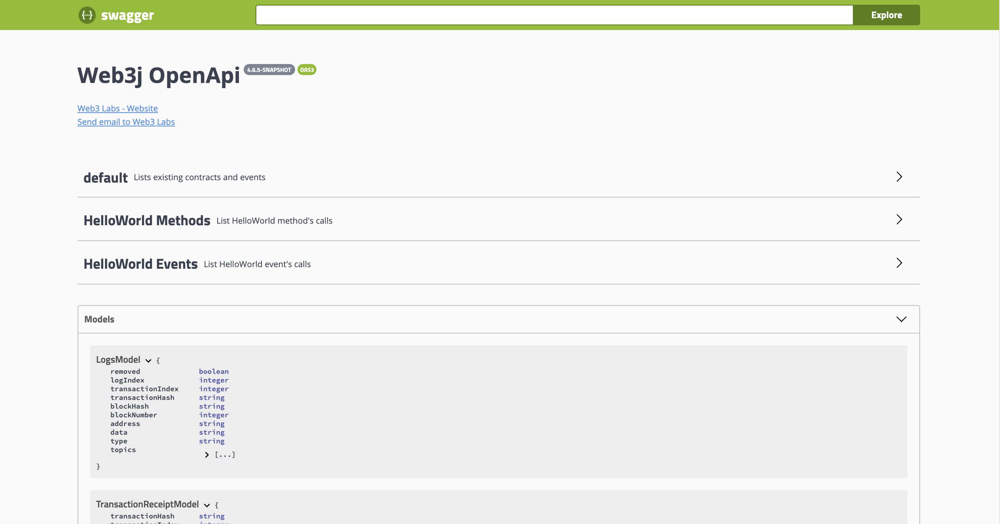
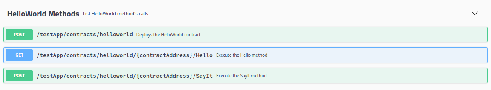
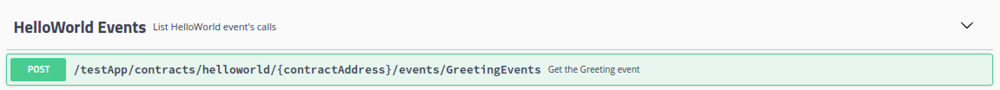
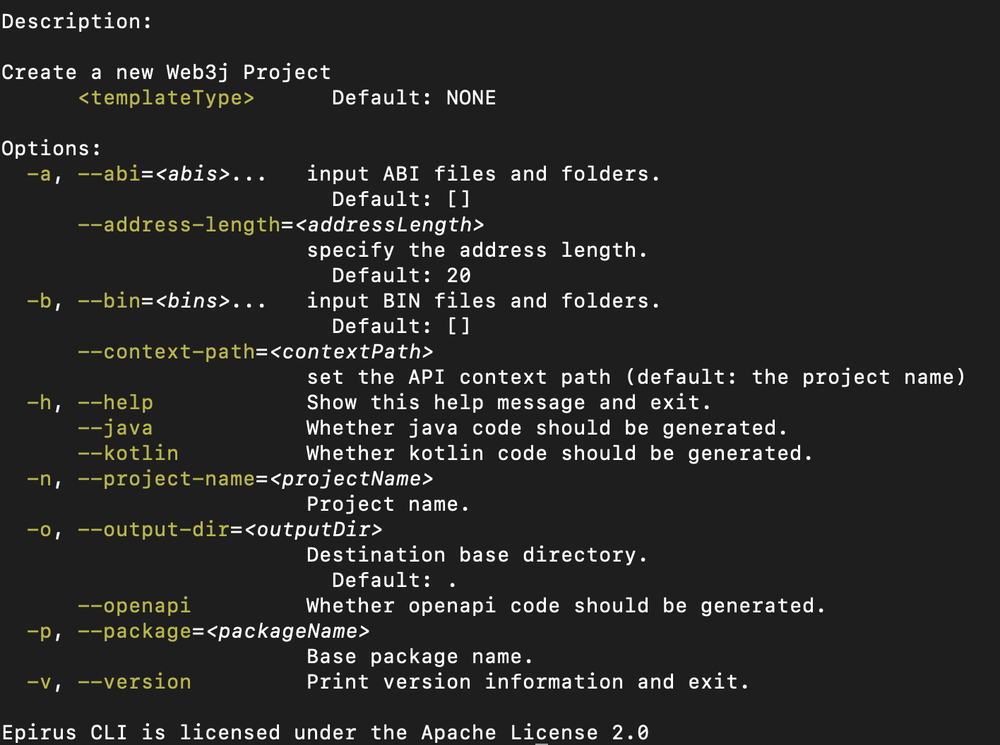
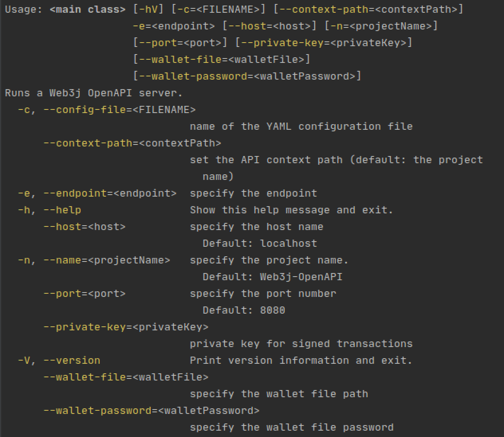
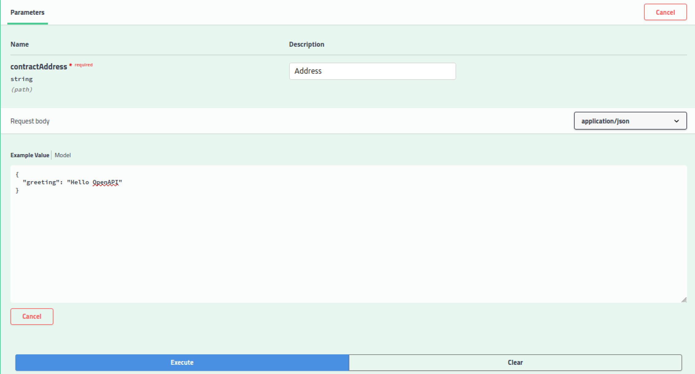

# Web3j-OpenAPI

[Web3j-OpenAPI](https://github.com/web3j/web3j-openapi) is an [OpenAPI](https://swagger.io/specification/) compliant service generator for [Solidity](https://solidity.readthedocs.io/) smart contracts. It provides a way to interact with the [Ethereum](https://ethereum.org/) blockchain via simple and intuitive HTTP requests. These interactions can be done using plain HTTP requests or via the [Swagger-UI](https://swagger.io/tools/swagger-ui/), which is generated with every project.

This workflow can be summed in the following steps:
- Writing a solidity smart contract
- Generating the corresponding OpenAPI project using Web3j-OpenAPI
- Running the generated project
- Sending HTTP requests using the Swagger-UI, `Curl` or other.

## Example
The following Hello World contract :

```
pragma solidity ^0.6.0;

contract HelloWorld {

 event Greeting(string greet);
 
 function hello() public pure returns (string memory) {
   return 'Hello Web3j-OpenAPI';
 }
 
 function sayIt(string memory greeting) public returns (string memory) {
   emit Greeting(greeting);
   return greeting;
 }
}
```

generates the following `OpenAPI` specs : 

```
{
  "openapi": "3.0.1",
  "info": {
    "title": "Web3j OpenApi",
    "contact": {
      "name": "Web3 Labs",
      "url": "http://web3labs.com",
      "email": "hi@web3labs.com"
    },
    "version": "0.0.3.1"
  },
  "tags": [
    {
      "name": "default",
      "description": "Lists existing contracts and events"
    },
    {
      "name": "HelloWorld Methods",
      "description": "List HelloWorld method&#39;s calls"
    },
    {
      "name": "HelloWorld Events",
      "description": "List HelloWorld event&#39;s calls"
    }
  ],
  "paths": {
    "/SimpleJavaProject/contracts/helloworld/{contractAddress}/Hello": {
      "get": {
        "tags": [
          "HelloWorld Methods"
        ],
        "summary": "Execute the Hello method",
        "operationId": "hello",
        "parameters": [
          {
            "name": "contractAddress",
            "in": "path",
            "required": true,
            "schema": {
              "type": "string"
            }
          }
        ],
        "responses": {
          "default": {
            "description": "default response",
            "content": {
              "application/json": {
                "schema": {
                  "$ref": "#/components/schemas/ResultModelString"
                }
              }
            }
          }
        }
      }
    },
...
```

With a corresponding `Swagger-UI` : 


The available methods are:



The available events are:




## Use cases
An OpenAPI project can be generated using the [Epirus-CLI](https://github.com/epirus-io/epirus-cli) as follows:

```ssh
$ epirus import openapi -p com.helloworld -o . --abi helloworld.abi --bin helloworld.bin --name helloworld
```

Then, the generated project can be used in the following ways:

**Creating a Gradle project that can be run using the application plugin:**
```ssh
$ cd helloworld
$ ./gradlew run // Starts the server exposing Helloworld.sol
...
```

**Starting the server using the ShadowJar:**
```ssh
$ ./gradlew shadowJar // Create an executable JAR that starts the server
$ java -jar helloworld-server-all.jar
...
```

**Using the CLI:**

```ssh
$ ./gradlew installDist // Create an executable to start the server
$ ./helloworld-server
```

# Getting started with Web3j-OpenAPI

## How to generate a project:
To generate an OpenAPI project using the [Web3j-OpenAPI](https://github.com/web3j/web3j-openapi) generator, you need to have the [Epirus-CLI](https://github.com/epirus-io/epirus-cli) installed on your machine (Note - the Epirus CLI has replaced the Web3j CLI). 
It’s easy to do (for Windows instructions head [here](https://docs.epirus.io/quickstart/#installation)):
	
```
$ curl -L get.epirus.io | sh
```

And then, you can run the
```
$ epirus import --openapi --help
```
To check the generator available options. 



In this case, we will be using the above Hello World contract.
Put that contract in a file named `HelloWorld.sol` for starters.
To compile it, you can use solc via [SVM](https://blog.web3labs.com/a-solidity-version-manager-using-sokt). This lets you handle multiple solidity compiler versions easily:

```
$ svm install 0.6.0
$ svm use 0.6.0
$ solc --abi --bin -o . HelloWorld.sol
```

Now, you should  see the ABI and Bin files in the directory. You  can use them to generate the OpenAPI:
```	
$ epirus import --openapi --abi HelloWorld.abi --bin HelloWorld.bin --package-name com.tutorial --output . --name HelloWorldProject
```
You should be seeing logs similar to the following:


## How to build

You have two possibilities:

#### Generate the ShadowJAR
`./gradlew shadowJar` Which you can find in the `server/build/libs` folder.

#### Generate the distributions
`./gradlew installDist` Which you can find in the `server/build/install/HelloWorldProject-server/bin` folder.

## Configurations
In all cases, we need to specify the runtime configuration. 

For example, the `private key` or `wallet file` for the signing, the `node endpoint` to connect to, etc.

To see the available options, try to run the `distributions` or the `JAR` with the `--help` flag. You'll get the following display:



To specify these parameters, we have three ways:

#### Environment variables
The rule is to:
- Replace the `-` with a `_` : `private-key => private_key`
- Upper case the options' names : `private-key => PRIVATE_KEY`

And export them:
	`Export PRIVATE_KEY={your private key} `

#### Configuration file
We can pass in a configuration file in two ways:

##### Via an environment variable
```
Export CONFIG_FILE={the path to the config file}
```
##### Via the CLI
```
--config--file {path to file}
```
Also, there is the possibility to put the config file in the default directory: `~/.epirus/web3j.openapi.properties`

A configuration file is similar to the following:
```
web3j.openapi.private.key={your private key}
web3j.openapi.port=9090
```
#### Directly from the CLI
The usual way:  `--private-key {your private key}`

Then, we are ready to run the project.

## Run the project
We can run the project directly : `./gradlew run`
However, specifying the runtime parameters in this case from the CLI is tricky. For this case, either use environment variables or Default Configuration file as stated above.

#### Run the FatJAR
```ssh
$ java -jar server/build/libs/HelloWorldProject-server-all.jar [arguments]
```

#### Run the distributions binary
```ssh
$ ./server/build/install/HelloWorldProject-server/bin/HelloWorldProject-server [arguments]
```

You should be able to run the server and see the following:


## Interact with the generated project:
Interactions can be done using HTTP requests either through `Curls`:
```ssh
$ curl -X POST "http://{host}:{port}/{application name}/contracts/helloworld/{contractAddress}/SayIt" -H  "accept: application/json" -H  "Content-Type: application/json" -d "{\"greeting\":\"Hello OpenAPI\"}"
```
Or, the `SwaggerUI`, on the link `{host}:{port}/swagger-ui`:



To interact via Java/Kotlin:

```groovy
dependencies {
    implementation "web3j-openapi:web3j-openapi-client:0.1.0"
}
```

And within a client application:

```
val service = ClientService("http://localhost:8080")
val helloWorld = ClientFactory.create(HelloWorldApi::class.java, service)

val receipt = helloWorld.contracts.greeter.deploy(
    GreeterDeployParameters("Test greeter")
)

val greeter = helloWorld.contracts.greeter.load(receipt.contractAddress)
```

# Ways to generate an OpenAPI project

## Generate a hello world project

A Hello World project is a simple project based on a simple solidity contract.
It is generated using:
```
$ epirus new --openapi
```
Then, follow the interactive process.

This project can be used as a minimal project to start building your custom application
upon.

## Generate using custom solidity smart contracts

To generate a project using your favorites smart contracts, use the following command:

```
$ epirus import --openapi \
    --abi <list to your abi files> \
    --bin <list to your binary files> \
    -- project-name <project name> \
    --package-name <package name>
```

## Generate the API only

To generate only the API, which is the defined endpoints with their  implementations,
use the following:

```
$ epirus openapi generate \
    --abi <list to your abi files> \
    --bin <list to your binary files> \
    -- project-name <project name> \
    --package-name <package name>
```

This command will not generate the gradle build files. Thus, you will not have a
runnable application. To have one, check `Generate a hello world project` (link)
and `Generate using custom solidity smart contracts` (link).


# Generation options

# Run the project

## Runtime parameters

Before running the server, there are some parameters that need to
be set. There are multiple ways of doing so:

- Through environment variables
- Through a configuration file
- or, via passing the parameters directly to the JAR or the executable.

Also, you can run the project without worrying about any of this
using the `Epirus-cli` (put link to how to run using the epirus-cli)

### Supported parameters

|  Name                   | Default value                       | Description |
|-------------------------|:-----------------------------------:|-------------|
| `name`                  | `Generation project name`           | The project name |         
| `config file`           | `none`                              | A custom configuration file to import extra parameters |     
| `endpoint`              | `none`                              | Ethereum node endpoint to target when interacting with the blockchain |
| `privateKey`            | `none`                              | User private key in hex format prefixed by `0x` |
| `wallet path`           | `none`                              | The path to the wallet file (can be absolute or relative) |
| `wallet password`       | `none`                              | The password of the specified wallet file in plain text |
| `host`                  | `localhost`                         | The server host (can be an IP address or a hostname) |
| `port`                  | `8080`                              | The server port |
| `contract addresses`    | `none`                              | Use pre-deployed contract addresses: `contract1=0x123,contract2=0x1234`. All you need to provide to the generator is the ABIs. |

The necessary parameters are:

- The Ethereum node endpoint to target when 
interacting with the blockchain `endpoint`.

- Credentials : which can be either `privateKey`, or `wallet path` and `wallet password`

The remaining options are optional.

#### the order of precedence

The parameters can be specified interchangeably between different sources.
ie, you can have some defined in a default configuration file and others in environment
variables etc.

However, for duplicated values, we enforce the following order :

1. CLI arguments
2. Custom configuration file specified in the CLI
3. Custom configuration file specified in Environment variables
4. Default configuration file 
5. Environment variables

Check the following sections for more information.

#### CLI arguments

The CLI arguments can be passed to the command the usual way.

##### Example

Check the `Starting the server` section to choose a command.

```shell script
$ <command> \
    --private-key 0x1234 \
    --name OpenApiProject \
    --endpoint <Ethereum node endpoint> \
    --host localhost \
    --port 9090 \
    --contract-addresses contract1=0x1234,contract2=0x123
```

#### Configuration file

You can put the parameters in a **configuration file**. This latter, can be 
`YAML`, `Json` or `Java properties` type of files.

The configuration file can be :

- Put in the default directory : `~/.epirus/web3j.openapi.<extension>`
- Set in an environment variable: `WEB3J_OPENAPI_CONFIG_FILE` where the value is the path
to the file
- Set as an argument when running the JAR or the executable: `--config-file`

The supported extensions are :

- `yaml` for a `YAML` configuration. Example:
```yaml
contractAddresses: 
  helloworld: "0x1234"
  helloworld2: "0x1234"
credentials: 
  privateKey: "0x1234"
network: 
  endpoint: "your node endpoint address"
project: 
  name: OpenApiProject
server: 
  host: localhost
  port: 9090
```

- `json` for a `Json` configuration. Example:
```json
{
  "contractAddresses": {
    "helloworld": "0x1234",
    "helloworld2": "0x1234"
  },
  "credentials": {
    "privateKey": "0x1234"
  },
  "network": {
    "endpoint": "your node endpoint address"
  },
  "project": {
    "name": "OpenApiProject"
  },
  "server": {
    "host": "localhost",
    "port": 9090
  }
}
```
- `properties` for a `Java properties` configuration. Example:
```properties
contractAddresses=helloworld=0x1234,helloworld2=0x1234
credentials.privateKey=0x1234
network.endpoint=your node endpoint address
project.name=OpenApiProject
server.host=localhost
server.port=9090
```


#### Environment variables

The easiest way to provide the runtime parameters is through environment variables.

##### Example
```shell script
$ export WEB3J_ENDPOINT=<link to your Ethereum node>
$ export WEB3J_OPENAPI_HOST=localhost
$ export WEB3J_OPENAPI_PORT=9090
$ export WEB3J_OPENAPI_NAME=Web3jOpenAPI
$ export WEB3J_OPENAPI_CONTRACT_ADDRESSES=helloworld=0x1234,helloworld2=0x12345
$ export WEB3J_OEPNAPI_CONFIG_FILE=~/myConfig.yaml
```
And one of the following:

- A raw private key :
```shell script
$ export WEB3J_PRIVATE_KEY=0x1234
```
- A wallet :
```shell script
$ export WEB3J_WALLET_PATH=~/myWallet.json
$ export WEB3J_WALLET_PASSWORD=myStrongPassword
```

## Start the server

Starting the server can be done in the following ways:

### The generated JAR

A `JAR` can be generated using the following command:

`$ ./gradlew shadowJar`

It will be found in the `build/libs` directory `server/build/libs/ProjectName-server-all.jar`
or `build/libs/ProjectName-all.jar` depending on the project.
(To be checked again)

The generated `JAR` can be run using the following:

`$ java -jar build/libs/ProjectName-all.jar <parameters>`

check the parameters section (link) for the supported parameters.

### The distribution executable

A server executable can be generated using the following:

`$ ./gradlew installShadowDist`

Which can be found in `build/install/`


### 